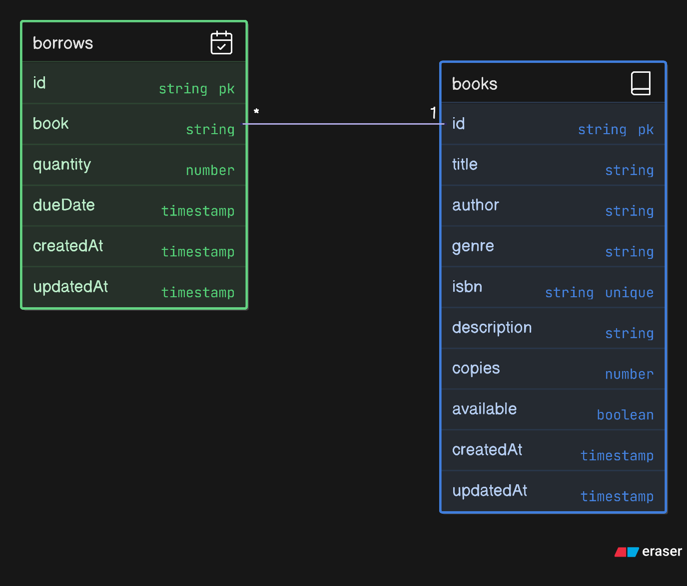

# 📚 Library Management API – Express + TypeScript

A backend system for managing a digital library, built with **Express.js**, **TypeScript**, and **MongoDB**. It supports book cataloging, borrowing workflows, and strict data validation using Mongoose and Zod.

---

## 🚀 Features

- ✅ RESTful API for managing books and borrowing
- 📦 Modular project structure using TypeScript
- 🌿 Environment configuration using `.env`
- 🔐 Robust validation using Zod + Mongoose
- 📊 MongoDB Aggregation for borrow summary
- 🧠 Static & Instance Methods for business logic
- ⛔ Mongoose Middleware (`pre`, `post`) support
- 🔍 Filter & Sort query parameters

---

## 📁 Project Structure

```
.
├── README.md
├── biome.json               # BiomeJS config for linting & formatting
├── package.json             # Project metadata
├── pnpm-lock.yaml           # Lockfile
├── tsconfig.json            # TS config for dev
├── tsconfig.build.json      # TS config for prod build
└── src
    ├── app.ts               # Express app config
    ├── server.ts            # Entry point
    ├── configs/             # Env & DB setup
    ├── controller/          # Business logic
    ├── interfaces/          # TypeScript interfaces
    ├── middlewares/         # Error handler, Zod validation
    ├── models/              # Mongoose models (Book, Borrow)
    ├── routes/              # Express route definitions
    └── schemas/             # Zod validation schemas
```

---

## 🎨 API Design

### 📘 Book Endpoints

| Method | Endpoint             | Description                          |
|--------|----------------------|--------------------------------------|
| POST   | `/api/books`         | Add a new book                       |
| GET    | `/api/books`         | List all books (with filter & sort)  |
| GET    | `/api/books/:id`     | Get a single book by ID              |
| PUT    | `/api/books/:id`     | Update book fields (e.g., copies)    |
| DELETE | `/api/books/:id`     | Delete a book                        |

### 📖 Borrow Endpoints

| Method | Endpoint      | Description                                                                |
|--------|---------------|----------------------------------------------------------------------------|
| POST   | `/api/borrow` | Borrow a book (checks quantity, updates copies, handles availability flag) |
| GET    | `/api/borrow` | Aggregated borrow summary by book (`title`, `isbn`, `totalQuantity`)       |

---

## 🛠️ Getting Started

### 1️⃣ Clone & Install

```bash
git clone https://github.com/coder7475/library_management_apis.git
cd library_management_apis
pnpm install
```

### 2️⃣ Environment Setup

Create a `.env` file in the root directory:

```
PORT=5000
HOST=localhost
NODE_ENV=development
MONGODB_URI="mongodb://127.0.0.1:27017/your_db_name"
```

### 3️⃣ Run in Development

```bash
pnpm run dev
```

### 4️⃣ Format & Lint

```bash
pnpm format && pnpm lint
```

### 5️⃣ Build for Production

```bash
pnpm run build
```

---

## 🔎 API Query Parameters

For `/api/books`:

| Query Param | Description                       |
|-------------|-----------------------------------|
| `filter`    | Filter books by genre             |
| `sortBy`    | Field to sort by (e.g., `title`)  |
| `sort`      | Sort order: `asc` or `desc`       |
| `limit`     | Limit number of books returned    |

---

## 📈 Data Model




---

## ⚙️ Business Logic

- ✅ Prevent borrow if available copies < requested quantity
- ➖ Deduct `quantity` from book’s `copies`
- ❌ If `copies` becomes 0, set `available` to `false`
- 📈 Borrow summary via MongoDB aggregation
- 🧠 Logic implemented using static & instance methods

---

## 📦 Built With

- [Express](https://expressjs.com/)
- [TypeScript](https://www.typescriptlang.org/)
- [MongoDB + Mongoose](https://mongoosejs.com/)
- [Zod](https://zod.dev/)
- [pnpm](https://pnpm.io/)
- [Biome](https://biomejs.dev/)

---

## 📄 License

Licensed under the [MIT License](LICENSE). Free to use and modify.
